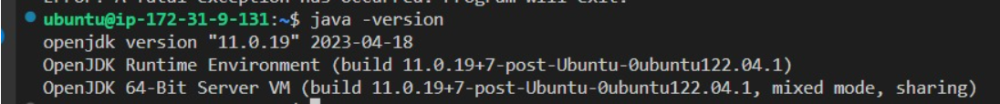

# Manual Técnico - SO2 - Practica 1

# Integrantes

| Carné | Nombre |
| --- | --- |
| 201800476 | Marvin Alexis Estrada Florian |
| 202001534 | Erwin Fernando Vásquez Peñate |
| 202000119 | Sergie Daniel Arizandieta Yol |

# Instalación de herramientas

## **GCC y Make**

Para verificar si están instaladas las herramientas:

```jsx
gcc --version

make --version
```

Si falta GCC, también se instala make:

```jsx
sudo apt install build-essential

sudo apt-get install manpages-dev
```

## Instalación Java

```bash
// Actualizar el sistema
sudo apt update
// Instalar lo necesario para Java
sudo apt install default-jdk
sudo apt install default-jre
sudo apt update
// Verificar si java fue correctamente instalado en el sistema
java - version
```



# Módulos

## Compilación de los módulos

```jsx
// Dirigirse al directorio del módulo y ejecutar el siguiente comando
make all
```

## Limpiar la consola de mensajes

```jsx
sudo dmesg -C
```

## Inserción del modulo

```jsx
sudo insmod <<module_name>>.ko
```

## Obtener los mensajes del módulo

```jsx
sudo dmesg
```

## Información de los procesos

```jsx
// Dirigirse al directorio proc
cd /proc
// Listar módulos
ls
// Leer el archivo
cat <<module_name>>
```

## Eliminación del modulo

```jsx
sudo rmmod <<module_name>>.ko
```

## Explicación de los módulos

### Módulo De Memoria

- Para que funcione el módulo de manera correcta se necesitan estas importaciones, las cuales nos ayudan a usar información del kernel y del sistema.

```c
#include <linux/sysinfo.h>
#include <linux/mm.h> 
//Header para la ram
#include <linux/module.h>
// para usar KERN_INFO
#include <linux/kernel.h>
//Header para los macros module_init y module_exit
#include <linux/init.h>
//Header necesario porque se usara proc_fs
#include <linux/proc_fs.h>
/* for copy_from_user */
#include <asm/uaccess.h>	
/* Header para usar la lib seq_file y manejar el archivo en /proc*/
#include <linux/seq_file.h>
```

- Métodos que se ejecutan tanto cuando se inicializa el módulo como también cuando se elimina, dejando un mensaje que puede verse con el comando “dmesg”.

```c
static int _insert(void)
{
    proc_create("mem_grupo8", 0, NULL, &operaciones);
    printk(KERN_INFO "Hola mundo, somos el grupo 8 y este es el monitor de memoria\n");
    return 0;
}

static void _remove(void)
{
    remove_proc_entry("mem_grupo8", NULL);
    printk(KERN_INFO "Sayonara mundo, somos el grupo 8 y este fue el monitor de memoria\n");
}

module_init(_insert);
module_exit(_remove);
```

- Función que se ejecuta al hacerle cat al módulo.

```c
//Funcion que se ejecuta cuando se le hace un cat al modulo.
static int al_abrir(struct inode *inode, struct file *file)
{
    return single_open(file, escribir_archivo, NULL);
}
```

- Función para escribir el archivo, mediante la estructura sysinfo se obtiene la información de la memoria, en este caso se obtiene la memoria ocupada, libre y el total de memoria disponible.

```c
static int escribir_archivo(struct seq_file *archivo, void *v)
{
    struct sysinfo info;
    si_meminfo(&info);

    seq_printf(archivo, "{\n");
    seq_printf(archivo, "\"totalram\":%lu,\n", info.totalram * info.mem_unit / 1024 / 1024);
    seq_printf(archivo, "\"ramlibre\":%lu,\n", info.freeram * info.mem_unit / 1024 / 1024);
    seq_printf(archivo, "\"ramocupada\":%lu\n", (info.totalram -  info.freeram )* info.mem_unit / 1024 / 1024);
    seq_printf(archivo, "}\n");

    return 0;
}
```

### Módulo de CPU

- Para que funcione el módulo de manera correcta se necesitan estas importaciones, las cuales nos ayudan a usar información del kernel y del sistema.

```c
#include <linux/fs.h>
#include <linux/init.h>
#include <linux/kernel.h>
#include <linux/module.h>
#include <linux/seq_file.h>
#include <linux/stat.h>
#include <linux/string.h>
#include <linux/uaccess.h>
#include <linux/mm.h>
#include <linux/sysinfo.h>
#include <linux/sched/task.h>
#include <linux/sched.h>

#include <linux/module.h>
// para usar KERN_INFO
#include <linux/kernel.h>
//Header para los macros module_init y module_exit
#include <linux/init.h>
//Header necesario porque se usara proc_fs
#include <linux/proc_fs.h>
/* for copy_from_user */
#include <asm/uaccess.h>	
/* Header para usar la lib seq_file y manejar el archivo en /proc*/
#include <linux/seq_file.h>
```

- Métodos que se ejecutan tanto cuando se inicializa el módulo como también cuando se elimina, dejando un mensaje que puede verse con el comando “dmesg”.

```jsx
static int _insert(void)
{
    proc_create("cpu_grupo8", 0, NULL, &operaciones);
    printk(KERN_INFO "Hola mundo, somos el grupo 8 y este es el monitor de CPU\n");
    return 0;
}

static void _remove(void)
{
    remove_proc_entry("cpu_grupo8", NULL);
    printk(KERN_INFO "Sayonara mundo, somos el grupo 8 y este fue el monitor de CPU\n");
}

module_init(_insert);
module_exit(_remove);
```

- Función que se ejecuta al hacerle cat al módulo.

```jsx
//Funcion que se ejecuta cuando se le hace un cat al modulo.
static int al_abrir(struct inode *inode, struct file *file)
{
    return single_open(file, escribir_archivo, NULL);
}
```

- Función que devuelve el estado de cada proceso.

```jsx
static const char* obtain_state(int estado)
{
    const char* estado_str;

    switch (estado) {
        case 0:
            estado_str = "ejecucion";
            break;
        case 1:
        case 1026:
            estado_str = "suspendido";
            break;
        case 128:
            estado_str = "detenido";
            break;
        case 260:
            estado_str = "zombie";
            break;
        default:
            estado_str = "desconocido";
            break;
    }

    return estado_str;
}
```

- Función que recupera todos los procesos existentes en el sistema

```jsx
static int escribir_archivo(struct seq_file *archivo, void *v)
{
    int porcentaje;
    //seq_printf(archivo, "================\n");

    porcentaje = calcular_porcentaje_cpu_total();
    
    if (porcentaje == -1) {
        seq_printf(archivo, "No se pudo calcular el porcentaje de CPU total\n");
    } else {
        //seq_printf(archivo, "Porcentaje de CPU total: %d\n", porcentaje);

        seq_printf(archivo, "{\n");
        seq_printf(archivo, "\"totalcpu\":%d,\n", porcentaje);
        seq_printf(archivo, "\"tasks\":\n");

        int count_running = 0, count_sleeping = 0, count_stopped = 0, count_zombie = 0, count_total = 0;
        struct task_struct* cpu;
        int ram, separator, childseparator;
        separator = 0;
        childseparator = 0;
        seq_printf(archivo, "[");
        for_each_process(cpu){
            if(separator){
                seq_printf(archivo, ",");
            }
            seq_printf(archivo, "{\"pid\":");
            seq_printf(archivo, "%d", cpu->pid);
            seq_printf(archivo, ",\"nombre\":");
            seq_printf(archivo, "\"%s\"", cpu->comm);
            seq_printf(archivo, ",\"usuario\": \"");
            seq_printf(archivo, "%d", cpu->real_cred->uid);
            seq_printf(archivo, "\",\"estado\": \"");
            seq_printf(archivo, "%s", obtain_state(cpu->__state));
	    seq_printf(archivo, "\"");
            if (cpu->mm) {
                ram = (get_mm_rss(cpu->mm)<<PAGE_SHIFT)/(1024*1024); // MB
                seq_printf(archivo, ",\"ram\":");
                seq_printf(archivo, "%d", ram);
            }
            seq_printf(archivo, ",\"padre\":");
            seq_printf(archivo, "%d",  cpu->parent->pid);
            seq_printf(archivo, "}\n");
            separator = 1;

            //contar 
            count_total++;
            switch(cpu->__state) {
                case TASK_RUNNING:
                    count_running++;
                    break;
                case TASK_INTERRUPTIBLE:
                case TASK_UNINTERRUPTIBLE:
                    count_sleeping++;
                    break;
                case TASK_STOPPED:
                    count_stopped++;
                    break;
                case EXIT_ZOMBIE:
                    count_zombie++;
                    break;
                default:
		    count_sleeping++;
                    break;
            }
        }

        seq_printf(archivo, "],\n");
        seq_printf(archivo, "\"running\": %d,\n", count_running);
        seq_printf(archivo, "\"sleeping\": %d,\n", count_sleeping);
        seq_printf(archivo, "\"stopped\": %d,\n", count_stopped);
        seq_printf(archivo, "\"zombie\": %d,\n", count_zombie);
        seq_printf(archivo, "\"total\": %d\n", count_total);
        seq_printf(archivo, "}\n");
    }

    return 0;
}
```

# Backend

El backend para esta aplicación fue realizado en Go, en su versión 1.18.

## Importaciones necesarias

```go
import (
	"github.com/gorilla/mux"
	"github.com/rs/cors"
	"encoding/json"
	"io/ioutil"
	"net/http"
	"os/exec"
	"strconv"
	"strings"
	"log"
	"fmt"
)
```

## Structs utilizadas

Estas structs nos sirven para almacenar la información obtenida de los módulos y poder devolverlos al front-end en un formato más fácil de digerir.

```go
type Process struct {
	Pid     int    `json:"pid"`
	Nombre  string `json:"nombre"`
	Usuario string `json:"usuario"`
	Estado  string `json:"estado"`
	Ram     int    `json:"ram"`
	Padre   int    `json:"padre"`
}

type CPUInfo struct {
	TotalCPU int       `json:"totalcpu"`
	Running  int       `json:"running"`
	Sleeping int       `json:"sleeping"`
	Stopped  int       `json:"stopped"`
	Zombie   int       `json:"zombie"`
	Total    int       `json:"total"`
	Tasks    []Process `json:"tasks"`
}

type RAMInfo struct {
	TotalRAM    int `json:"totalram"`
	RAMLibre    int `json:"ramlibre"`
	RAMOcupada  int `json:"ramocupada"`
}

type general struct {
	TotalRAM    int `json:"totalram"`
	RAMLibre    int `json:"ramlibre"`
	RAMOcupada  int `json:"ramocupada"`
	TotalCPU    int `json:"totalcpu"`
}

type counters struct {
	Running  int       `json:"running"`
	Sleeping int       `json:"sleeping"`
	Stopped  int       `json:"stopped"`
	Zombie   int       `json:"zombie"`
	Total    int       `json:"total"`
}

type AllData struct {
	AllGenerales    []general    `json:"AllGenerales"`
	AllTipoProcesos []Process  `json:"AllTipoProcesos"`
	AllProcesos     []counters   `json:"AllProcesos"`
}
```

## Servidor

El servidor fue configurado gracias a la librería “gorilla/mux” que nos ofrece Go.

```go
func main() {
	fmt.Println("************************************************************")
	fmt.Println("*                 SO2 Practica 1 - Grupo 8                 *")
	fmt.Println("************************************************************")

	router := mux.NewRouter().StrictSlash(true)
	router.HandleFunc("/", handleRoute)
	router.HandleFunc("/tasks", handlePost).Methods("POST")
	router.HandleFunc("/tasks", handleGet).Methods("GET")

	handler := cors.Default().Handler(router)
	log.Fatal(http.ListenAndServe(":8080", handler))

	fmt.Println("Server on port 8080")

}
```